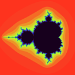
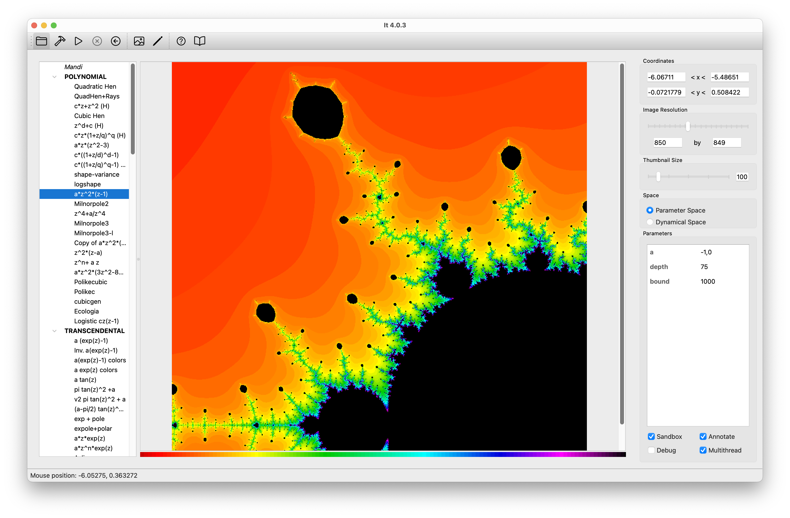

# It - Complex Function Iteration

## Introduction

*It* is a desktop application for researchers in complex dynamical systems.

*It* allows you to **visualize complex functions under iteration**, producing **fractal images** such as the famous Mandelbrot or Julia sets. *It* isn't limited to the Mandelbrot set, however. *It* lets you explore your own functions by **writing code** right inside the application. Your code is compiled on the fly and lets  you create **arbitrary graphics**.

mages can be scaled and zoomed into. Parameters - declared in your code - can be manipulated through the application's interface. Once your image is ready, it can be exported to a number of formats: PNG, PDF, and SVG.

Image generation is **fast** because code is compiled, not interpreted. Furthermore, It can take advantage of **multi-core** machines to further accelerate calculations.

You can have a quick look at some of the possibilities of It in the screenshots section. 

A [**manual**](doc/manual.md) is provided explaining how to code your own functions.

*It* works on MacOS, Linux, and Windows. You can **download** binaries from the [download section](doc/download.md).

*It* can be used free of charge under the MIT license. Should you require support, please contact the maintainer.

@2012-2025 Mannes Technology
