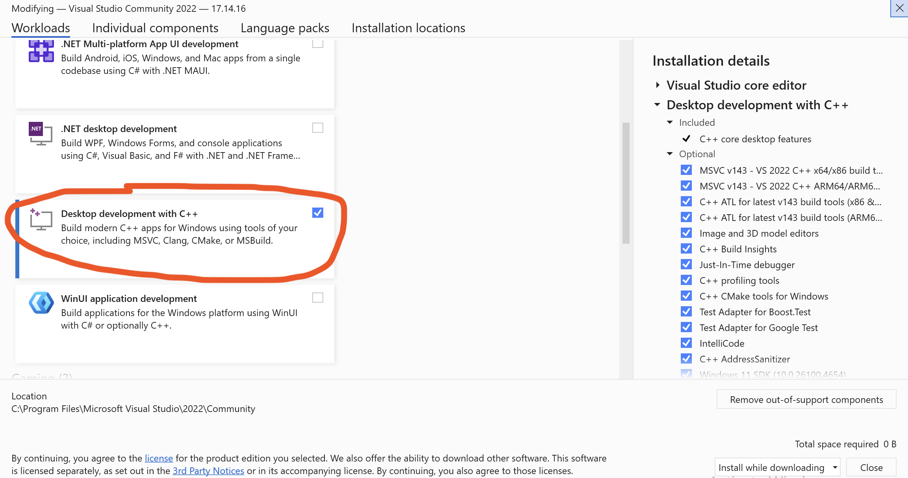

# *It* Download and Installation

*It* works under MacOS, Windows, and Linux. See the appropriate section for installation instructions on your platform.

## MacOS
*It* is supported for MacOS versions 11 (Big Sur) or newer. 
Binaries support both Apple Silicon (M1, M2, ...) and older Intel-based machines.

### Prerequisites
You must have a C++ compiler installed on your machine. On MacOS, this is 
done by opening a terminal and typing:
```sh
xcode-select --install
```
and following the on-screen instructions. If you don't know whether you have a compiler installed, type
```sh
which c++
```
in a Terminal window. If the command outputs something like `/usr/bin/c++`, you have a compiler.
If nothing appears, you do not.

### Installation Instructions:
- Download [It.dmg](https://github.com/christian-mannes/it/releases/download/4.0b1/It.dmg)
- Open the .dmg
- Drag It.app into the application folder (or anywhere else if you prefer)
- Double-click It.app to open it.

The first time you open *It*, you may be prompted to select a directory for
for your files. Select any directory you see fit. 

> Notice that if you had earlier versions
> of *It* installed on your machine, and if you have a directory `~/Library/Application Support/It`, this directory will be used.
> If this is not what you intended, use the File > Set Files Directory option.

## Windows
*It* supports Windows 11 - it may work on other versions but has not been tested.

### Prerequisites
You must have a C++ compiler installed on your machine. *It* assumes that you are using the MSVCC 2022 compiler - therefore we strongly recommend installing the [Visual Studio Community Edition](https://visualstudio.microsoft.com/vs/community/). When you run the Visual Studio Installer, select (at least) support for C++ development. The installer offers many options - make sure you select "Desktop Development with C++".



### Installation Instructions

- Download the installer
- Open the installer

## Linux
Due to the number of possible Linux distros we cannot provide binaries for every possible version.
We provide a binary release for Ubuntu. Should this not work for you, you should build from source (you will need Qt Creator 6.9.2 for this).

If you want to try the binary:
- Download ...
- Unzip it
- Open the "It" executable


