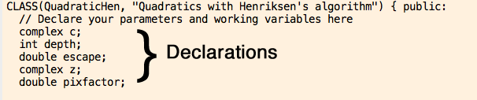
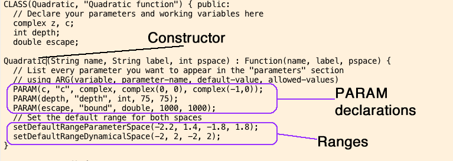
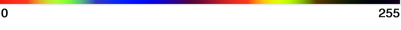
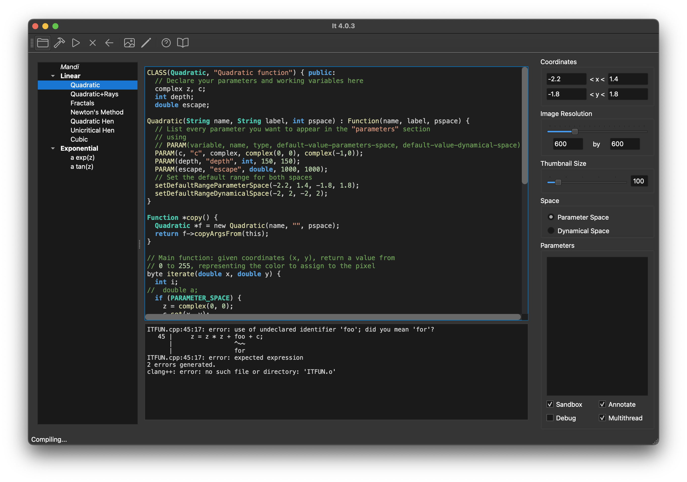

## *It* Manual

## The User Interface


## What's new in version 4.0
*It* has been rewritten for version 4.0. The new version maintains backward compatibility with older versions.

New features:
- Mac: support for Apple Silicon
- Windows version
- Linux version
- Open sourced, available on github
- Simplified installation / first time use
- Continuous colormaps - use `double iterate_(double x, double y)`
- Better code editor and error messages
- Export to PNG, SVG and PDF
- Debugging statement - messages shown in app
- Improved orbit drawing
- Can draw figure and show iterated figure
- Mouse and keyboard operations cheat sheet
- Adadpts to dark/light mode
- Python Notebook integration (experimental)

## Writing Your Own Functions

While *It* comes with some built-in functions, the real reason to use *It* is to create your own. Functions are written in the C++ language and are compiled on-the-fly by the application. C++ has a reputation of being a large and complex language. However, writing functions for It does not require any of the more esoteric features of C++, which is why a basic command of basic C and a ability to learn by example should be sufficient.

Creating a new function for *It*, in a technical sense, means creating a subclass of the C++ class called Function. From a practical point of view, creating a new function means choosing "New Function" from the File menu. This will present you with template code: that is, code that works as is (the quadratic function, i.e. the well-known Mandelbrot set). Your job will then be consist of the following steps:

1.    Declare your working variables
1.    Add/modify parameters.
1.    Implement the **iterate** function, which assigns a color to a given point in your image.
1.    Implement the **orbit** function, which tells the program how to iterate one step forward.
1.    Implement the **setParameter** function, which is used to switch from parameter space to dynamical space.

Optionally, you can also:

- Implement the **sandbox** function, which lets you manipulate the pixels of the image directly
- Implement he **annotate** function, which lets you add graphical annotation on top of the image.

### Variables Available to Functions

Since a function is a subclass of the Function class, you are given a number of variables that help you write your function. These variables are all uppercase (since they are really macros).
```
Variable          Type     Meaning

PARAMETER_SPACE   bool     True when in parameter space
DYNAMICAL_SPACE   bool     True when in dynamical space
XMIN              double   Range: minimal x-value (real coordinates)
XMAX              double   Range: maximal x-value
YMIN              double   Range: minimal y-value
YMAX              double   Range: maximal y-value
XRES              double   Image width in pixels
YRES              double   image height in pixels
```
### Declaring Variables and Parameters

You can declare working variables as you see fit at the beginning of the class declaration:



Every parameter must also be declared as a working variable. In order to turn a variable into a parameter (which shows up in the user interface), you have to use the PARAM declaration in the constructor (the constructor in a C++ class is a special function that is called when the object is first created. The constructor has the same name as the class.



An PARAM declaration has the following form:

```C++
PARAM(variable, name, type, default-value-parameters-space, default-value-dynamical-space)
```
where:

-    variable is the variable you have declared
-    name is a string you want to show up in the user interface
-    default-value-parameter-space is the default value when in parameter space
-    default-value-dynamical-space is the default value in dynamical space

In addition, you have to provide the default image range for both spaces, in the following way:
```
setDefaultRangeParameterSpace(xmin, xmax, ymin, ymax);
setDefaultRangeDynamicalSpace(xmin, xmax, ymin, ymax);
```

### copy
Writing a copy function is optional, but helpful if your code is not thread-safe. A copy function is written as follows:

```
Function *copy() {
 MyClassName *f = new MyClassName(name, "", pspace);
 return f->copyArgsFrom(this);
}
```

### iterate (Legacy version)

iterate is the most important function. When an image is computed, iterate is called for every pixel. Its two arguments (double x, double y) represent the coordinates of the pixel.

iterate must return a number between 0 and 255. This number is used as an index into the current colormap. You can see a preview of the colormap below the image region: 0 would be the leftmost color, and 255 would be the rightmost color:



How your function computes this number is entirely up to you. The example from the quadratic function shows how you can do two different things depending on whether you are in parameter or dynamical space:

```c++
byte iterate(double x, double y) {
  complex z;
  int i;
  if (PARAMETER_SPACE) {
    z = complex(0, 0);
    c.set(x, y);
  } else {
    z = complex(x, y);
  }
  for (i = 0; i < depth; i++) {
    z = z * z + c;
    if (norm(z) > escape * escape) break;
  }
  return (byte)(255*i/depth);
}
```

### iterate_ (New version)
Since version 4.0, continuous colormaps are supported. In the new version of iterate (called `iterate_` with an underscore), you should return a double in the interval [0, 1].

```c++
double iterate_(double x, double y) {
  complex z;
  int i;
  if (PARAMETER_SPACE) {
    z = complex(0, 0);
    c.set(x, y);
  } else {
    z = complex(x, y);
  }
  for (i = 0; i < depth; i++) {
    z = z * z + c;
    if (norm(z) > escape * escape) break;
  }
  return (double)i / depth; // instead of 0..255, return 0.0..1.0
}
```

### Thread-Safety
The `iterate` (or `iterate_`) function is normally called from multiple threads, that is, in parallel. This means that your function must be **thread-safe**. In practice this means that all variables that are manipulated inside the iterate function must be **local** to that function.
```c++
  // BAD
  
  complex z; // BAD: z is declared at class level
  
  double iterate_(double x, double y) {
    for (i = 0; i < depth; i++) {
      z = z * z + c;
    }
  }
```
The correct version would declare the working variable `z` locally:
```c++
  // GOOD
  
  double iterate_(double x, double y) {
    complex z; // good: z is declared locally
    for (i = 0; i < depth; i++) {
      z = z * z + c;
    }
    ...
  }
```
If you see a garbled image, it is most likely to non-thread-safe code. Try disabling the "multithread" option to confirm, then make your code thread-safe. Using a `copy` method in your class can also help because implementing it means that each thread uses a separate copy of your class.

### orbit

orbit represents a single pass through the function, or in a way, the "function" itself. You are passed a complex number, to which you should apply your function (i.e. modify it in-place). The example from the quadratic function:

```c++
void orbit(complex &x) {
  x =  x * x + c;
}
```

### setParameter

setParameter allows the program to switch from parameter space to dynamical space. As you command-move the mouse in parameter space, you can see a preview of the corresponding image in dynamical space. This is accomplished by calling setParameter. What setParameter actually does is up to you, but you should store the x/y value in a variable to use it dynamical space. In the quadratic function example, the parameter is called c (see the iterate example), and setParameter is implemented as follows:

```c++
void setParameter(double x, double y) {
 c.set(x, y);
}
```

### sandbox

sandbox is a function that is called after the image is created. It is meant as a way to experiment with alternative algorithms, or to manipulate the image. sandbox will typically use the macros SETPIXEL and GETPIXEL. There are two versions: SETPIXEL and SETPIXEL_. The former uses real coordinates (of the complex plane), whereas the latter uses image coordinates.

The macros you can use in this context are:
```
    SETPIXEL(x, y, color) -- set a pixel corresponding to real coordinates x, y
    SETPIXEL_(x, y, color) -- set a pixel in image coordinates (0, 0) is lower left
    GETPIXEL(x, y) -- returns the pixel value at real coordinates x,y
    GETPIXEL_(x, y) -- returns the pixel value at image coordinates x, y
    HLINE(x, y, dx, col) -- draw a line from point x, y to x+dx, y
    VLINE(x, y, dy, col) -- draw a line from x, y to x, y+dy
    HLINE_(x, y, dx, col) -- draw a line from point x, y to x+dx, y (image coordinates)
    VLINE_(x, y, dy, col) -- draw a line from x, y to x, y+dy (image coordinates)
```

### annotate

annotate allows you to add vector graphics to your image. For example, you can draw lines, rectangles, ellipses/circles, as well as text. For example, in order to ..., you could write:
```c++
void annotate() {
 // Draw a yellow 2x2 rectangle at -1,-1
 // Notice colors are given as red, green, blue, opacity where each ranges from 0..1
 SetFillColor(1, 1, 0, 1);
 FillRect(-1, -1, 2, 2);

 // Draw a red rectangle 300 by 300 pixels at bottom-left corner of image
 SetFillColor(1, 0, 0, 0.5);
 FillRect(0, 0, 300, 300, false);

 // Draw the text "foo" in white, using the Arial font
 SetFillColor(1,1,1,1);
 SetFont("Arial", 1);
 DrawText("foo", 1,1); 

 // Draw a blue line from -1,-1 to 1,1
 SetStrokeColor(0, 0, 1, 1);
 SetLineWidth(1);
 DrawLine(-1, -1, 1, 1);
}
```

Notice that many of the function have an optional argument realcoords, which if you omit it defaults to true. By setting realcoords to false, you can use image coordinates instead of real coordinates.

The following functions are available in this context:
```
    void SetStrokeColor(double r, double g, double b, double opa);
    void SetFillColor(double r, double g, double b, double opa);
    void SetLineWidth(double w);
    void DrawLine(double x0, double y0, double x1, double y1, bool realcoords = true);
    void DrawRect(double x, double y, double w, double h, bool realcoords = true);
    void FillRect(double x, double y, double w, double h, bool realcoords = true);
    void DrawEllipseInRect(double x, double y, double w, double h, bool realcoords = true);
    void FillEllipseInRect(double x, double y, double w, double h, bool realcoords = true);
    void SetFont(const char *name, double size);
    void DrawText(const char *txt, double x, double y, bool realcoords = true);
```

## Color Maps and Working with Colors

Color maps map a number from 0 to 255 to a color. The number from 0 to 255 is called the index into the color map. It comes with a number of color maps. Each map is defined in a text file, which contains 255 lines, each with a list of three numbers also between 0 and 255 separated by whitespaec. Each line defines a color using RGB encoding: intensities of red, green, and blue. For example, 0,0,0 represents black, 255,0,0 would be pure red, 255,255,0 is yellow, and 255,255,255 is white. A colormap file looks like this:


Color maps are installed in the directory `~/Library/Application Support/It/Maps`. Important: the OS X Finder will not show you this directory. In Finder, you have to use Go > Go to Folder, and type in `~/Library/Application Support/It/Maps`.

If you add another file in that directory (in the correct format), it will be used (you need to restart It to take effect).

However, if you simply want to use specific colors, you can use a simpler technique. You can inject colors into the current colormap by using the SETCOLOR(index, red, green, blue) call in the setColors function. For example, if you add the following method to your class, index 0 (the number you return from iterate) will correspond to red, and index 1 will be black, irrespective of the colormap choice.

```c++
void setColors() {
  SETCOLOR(0, 255, 0, 0);
  SETCOLOR(1, 0, 0, 0);
}
```

Notice that using setColors does not modify the current colormap file permanently.

If you are using the new-style `double iterate_(double x, double y)` function, you can also return a particular color for a point using the `rgb` function. `rgb` takes three arguments, each an int from 0..255.

```c++
double iterate_(double x, double y) {
  ...
  ...
  if (condition) {
    return rgb(255, 255, 0); // return yellow
  }
  ...
  ...
}
```

### Debugging Messages
You can use the `debug` function to produce debugging messages. `debug` works like `printf`, for example:
```c++
double iterate_(double x, double y) {
  complex z;
  int i;
  if (PARAMETER_SPACE) {
    z = complex(0, 0);
    c.set(x, y);
  } else {
    z = complex(x, y);
  }
  for (i = 0; i < depth; i++) {
    z = z * z + c;
    debug("%d: %f,%f", i, z.re, z.im); // <<<<<<------------- debug
    if (norm(z) > escape * escape) break;
  }
  return (double)i / depth; // instead of 0..255, return 0.0..1.0
}
```
Debug messages will only be shown if the "Debug" option is checked in the main window (bottom right). Even if that option is selected, only up to a maximum number of debug messages will be shown (by default 256). You can change this limit by using 
```
  setMaxDebug(newmax);
```
The appropriate place for `setMaxDebug` would be the constructor.


### Rays, Equipotentials and Sectors for Quadratic Maps

There are functions which allow you to draw rays, equipotential curves and sectors for the quadratic family.
This functions can be used from the sandbox function only.

You can find an example in the sample function Quadratic+rays.

The functions are:

1) Draw an equipotential curve of a given potential from the ray p/q to the ray theta with a certain escape bound:

  ```
  equipotential(c value,  potential value, p,  q , theta,  escape)
  ```

-- The c value is ignored if you are in parameter space.
-- The values can be arguments taken from the interface, but also can be numbers. Example:
equipotential(state, c, 0.25, 0, 1 , 1, 500)
will draw a full equipotential of potential 0.25, for the current c-value.

2) Draw an external ray of argument p/q, from 0 to a certain equipotential level, with resolution npoints and a certain escape bound, iterating depth times.

  ```
  rational_rays(c, depth, p, q, startingpot, escape, npoints);
  ```

3) Draw a sector around the ray of argument p/q, with a given slope, and until a certain equipotential. Given escape bound, number of iterations (depth) and resolution (points).

  ```
  draw_sect(c, p, q, slope, startingpotential, escaperadius, depth, npoints)
  ```

Example: draw_sect(c, 1,7,0.1,0.25,1000,75,40000)

 
## Compilation Errors
If you make a mistake in your code, It will not be able to compile your code. In this case, error messages will be shown below your code:



If you click on the part of the error message that contains the line number, the cursor will be set to the corresponding place in your code.
 

---

© 2012-2025 Mannes Technology

Mannes Technology Consulting S.L., Pl. Tirant lo Blanc 7, 08005 Barcelona
Reg. Merc. Barcelona Hoja B196344, Tomo 31785 Folio 102. CIF: B61977807
